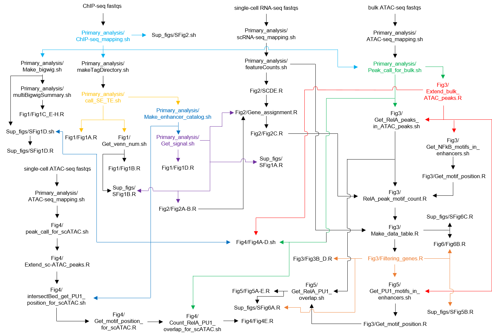

# Michida et al., 2020

## Introduction

This repository stocks source codes used in our paper, Michida et al., 2020. (Sorry, this paper is in press. Details will be updated after the publication.)  

These source codes performs the integrative sequence analysis. We hope our these source codes contribute your work about enhancers regulation, chromatin dynamics and so on.

## Usage  

First, please refer the table below and check the source codes which are used for figures you want to make. Then, please refer the files dependecy map and run all source codes on which the source codes to make the figures depend. The sequence data is provided at  DDBJ: DRA009412 (ATAC-seq, ChIP-seq of RelA and H3K27Ac and single-cell RNA-seq.) and DRA009931 (single-cell ATAC-seq). Please specify file path in the source codes as we described in them.

|Figures in the paper|Used source codes to plot|
|:--:|:--:|
|Fig.1A|Fig1A.R|
|Fig.1B|Fig1B.R|
|Fig.1C, E-H|Fig1C_E-H.R|
|Fig.1D|Fig1D.R|
|Fig.2A-B|Fig2A-B.R|
|Fig.2C|Fig2C.R|
|Fig.3A|By hand|
|Fig.3B,D|Fig3B_D.R|
|Fig.3C|By hand|
|Fig.3E|Parameter_estimation.py|
|Fig.3F|Fig3F.py|
|Fig.4A-D|Fig4A-D.sh|
|Fig.4E|Fig4E.R|
|Fig.5A-E|Fig5A-E.R|
|Fig.6A|By hand|
|Fig.6B|Fig6B.R|
|SFig.1A|SFig1A.R|
|SFig.1B|SFig1B.R|
|SFig.1C|Fig1C_E-H.R|
|SFig.1D|SFig1D.R|
|SFig.2|SFig2.sh|
|SFig.3A|Fig1C_E-H.R|
|SFig.3B|Fig2A-B.R|
|SFig.4A|Fig3B_D.R|
|SFig.4C-D|Gene_assignment.R|
|SFig.5A|Fig3B_D.R|
|SFig.5B|SFig5B.R|
|SFig.5C-F|Fig4A-D.sh|
|SFig.6A|SFig6A.R|
|SFig.6B|Fig5A-E.R|
|SFig.6C|SFig6C.R|

## The files dependency map (under construction)  

You may think this map is messy, but this is the  __integrative sequence analysis__. These source codes connect interactively each other.

## Author
- Hiroki Michida

## License
[MIT](LICENSE)